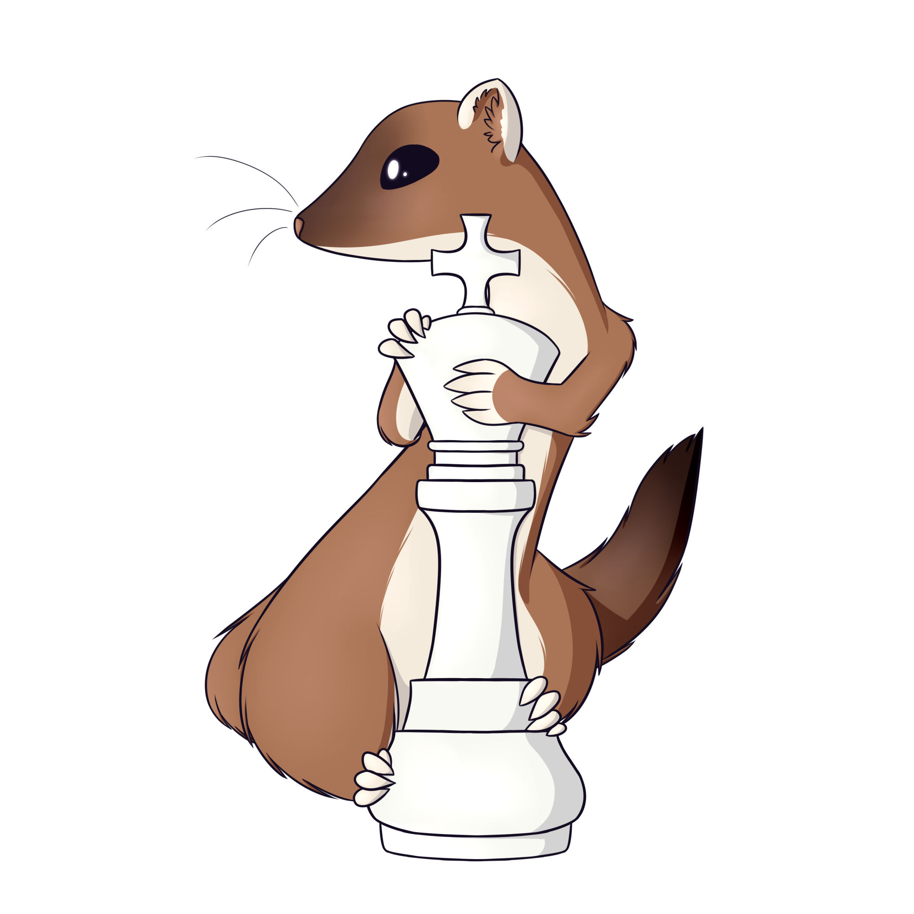

Weasel
===========


Art graciously provided by [Alex](https://www.deviantart.com/redhead-alex)

Table of Contents:

  * [About](#about)
  * [Downloading, or Compiling from Source](#downloading-or-Compiling-from-source)
  * [Contributing](#contributing)
  * [License](#license)

About
-----

Weasel is an 0x88 and bitboard based chess engine written entirely in Go. It utilizes alpha-beta pruining with null searhes to find the best possible moves in the shortest amount of time while utilizing the UCI (Universal Chess Interface) protocol. Weasel is programmed with all possible chess moves such as castling and En passant, as well as full knowlege on topics such as the 50 move rule and stalemates.

Downloading, or Compiling from Source
------------------------------------

You can find the most recent stable release [here](https://github.com/WeaselChess/Weasel/releases).

To compile from source, please do the following:

  * [Go](https://golang.org) installed and [configured](https://golang.org/doc/install)
  * [GoVersionInfo](https://github.com/josephspurrier/goversioninfo/) used for Icon and version info on windows
  * A chess GUI that can communicate over UCI. We recommend [CuteChess](https://github.com/cutechess/cutechess/releases)

  After you have Go and a GUI you can install Weasel simply with
  ```
  go get github.com/WeaselChess/Weasel
  ```
  And from within the Go src folder simply run the following to compile
  ```
  go generate
  go build
  ```

Contributing
------------

If you wish to contribute to our project, please contact us via [Email](mailto:contact@weaselchess.club). You may also submit a Pull Request to be reviewed.

License
-------

This project is currently licensed under GPLv3. This means that you may use our source for your own project, so long as it
remains open source and is licensed under GPLv3.

Please refer to the [license](/LICENSE) file for more information.
